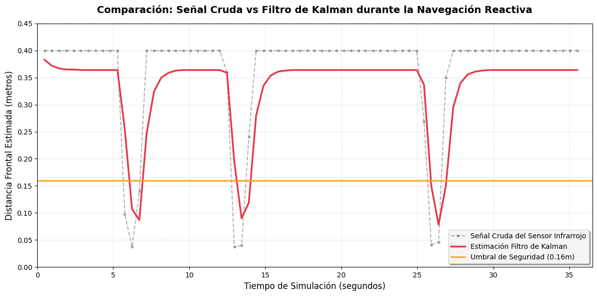

### Integrantes del Grupo
* Alonso Maurel
* Monserrath Morales
* Pablo Daza
* Miguel Bernales
* Nehemías Leiva

---

## Objetivo del Trabajo
El objetivo de este laboratorio es implementar y evaluar un sistema de percepción y fusión sensorial en un robot móvil autónomo utilizando simulación en Webots. Se busca combinar la información cinemática predictiva de los encoders con la medición del entorno proveniente de sensores de distancia mediante un Filtro de Kalman escalar, garantizando una navegación reactiva robusta y libre de colisiones en entornos de complejidad variable.

## Descripción del Robot y Sensores Utilizados
Para este proyecto se utilizó la plataforma robótica diferencial e-puck. Con el fin de cumplir con los requerimientos de percepción del entorno y estimación de movimiento, se instrumentaron múltiples sensores estratégicamente ubicados en el robot.

En cuanto a la percepción de proximidad, se emplearon sensores infrarrojos para la detección frontal de obstáculos, específicamente los modelos denominados `ps0` para el lado derecho y `ps7` para el lado izquierdo. Para asistir en la toma de decisiones durante las maniobras evasivas, se añadieron sensores laterales posicionados a 90 grados: el sensor `ps2` para el lateral derecho y el sensor `ps5` para el izquierdo. 

Adicionalmente, para obtener la odometría del robot, se utilizaron los encoders rotativos integrados directamente en el hardware motriz, leyendo de forma continua los datos proporcionados por el sensor de la rueda izquierda y de la rueda derecha.

## Frecuencia de Muestreo Empleada y Datos Registrados
El tiempo de muestreo del controlador ($T_s$) se vinculó directamente al paso básico de simulación del entorno mediante la función nativa de Webots. Esto permitió fijar el paso de tiempo en 32 milisegundos, lo que equivale a una frecuencia de muestreo de 31.25 Hz. Esta configuración es fundamental, ya que garantiza la captura síncrona y constante de todos los datos del hardware en cada iteración del reloj físico del simulador.

Para el análisis de los resultados, se optó por una captura observacional continua sin la programación de un límite de tiempo estricto en el código. La simulación se ejecutó en tiempo real y el registro fue pausado de forma manual a los 35 segundos de funcionamiento. Las métricas acumuladas hasta ese momento exacto se extrajeron mediante la transcripción de los registros de salida impresos en la consola del controlador. Gracias a la rigurosidad de la frecuencia de 32 ms, esta ventana de prueba generó de forma intrínseca un conjunto de datos compuesto por exactamente 1.095 muestras, las cuales se utilizaron posteriormente para la evaluación gráfica y analítica.

## Análisis de las Señales Registradas
Los sensores infrarrojos de proximidad instalados en el e-puck entregan lecturas crudas adimensionales, las cuales están diseñadas para distancias de cortísimo alcance. Para poder realizar un análisis físico coherente de la distancia hacia los obstáculos, fue importante implementar una función de conversión hiperbólica. Esta función matemática está basada en la atenuación geométrica de la luz a medida que viaja por el espacio, relacionando el valor crudo leído con una distancia en metros mediante la expresión $z_k = 15.0 / val_{max}^{0.8}$.

Durante el desarrollo de los ensayos con diversos obstáculos, se observó un fenómeno físico crucial relacionado con la absorción infrarroja. Se descubrió que las paredes blancas lisas de la arena reflejan eficientemente el haz de luz emitido por los sensores, permitiendo obtener lecturas muy estables incluso a distancias de 0.09 metros. Sin embargo, al introducir los bloques de madera oscura en el laberinto, la situación cambió drásticamente. El material oscuro absorbió una fracción altamente significativa de la luz emitida, lo que se tradujo en una lectura engañosa del entorno. Bajo estas condiciones, el robot estimaba erróneamente estar considerablemente más lejos del obstáculo de lo que realmente estaba. Este fenómeno físico exigió implementar un ajuste dinámico en los umbrales de seguridad para evitar colisiones inminentes.

## Estimación del Avance mediante Encoders (Odometría)
La cinemática diferencial del robot permite calcular el desplazamiento lineal total a partir de la mera variación angular medida por los encoders de las ruedas. Este cálculo se realiza evaluando la diferencia de ángulo entre el ciclo de control actual $k$ y el ciclo inmediatamente anterior $k-1$. 

Considerando que el radio físico de cada rueda del e-puck es de $0.0205$ metros, se aplican las ecuaciones cinemáticas clásicas para calcular el avance de cada rueda individualmente ($\Delta\theta_{izq}$ y $\Delta\theta_{der}$). Posteriormente, el avance central acumulado del robot ($\Delta d_k$) se obtiene promediando ambos desplazamientos lineales, lo que provee la información predictiva base para alimentar el filtro.

## Filtro Simple Aplicado
Antes de recurrir a técnicas de fusión sensorial más avanzadas, se evaluó de forma independiente un Filtro de Media Móvil Exponencial (EMA). El propósito de esta implementación preliminar fue intentar suavizar las perturbaciones rápidas y erráticas que presentaban los sensores de proximidad frontales al enfrentarse a diferentes superficies.

El filtro EMA se definió mediante una ecuación diferencial discreta que balancea el peso de la medición actual con el historial previo, utilizando un factor de suavizado constante $\alpha = 0.2$. Aunque los resultados mostraron que el filtro lograba reducir efectivamente el ruido de alta frecuencia en la señal, el costo de este suavizado fue la introducción de un retraso temporal severo (lag). Este retraso resultó ser altamente perjudicial durante las fases de aproximación rápida hacia los muros, inhabilitándolo como solución definitiva para la navegación reactiva.

## Implementación del Filtro de Kalman
Para superar las limitaciones del suavizado simple y lograr una estimación verdaderamente óptima de la distancia frontal libre, se diseñó un Filtro de Kalman lineal escalar. Este algoritmo es el núcleo del procesamiento del robot, ya que fusiona el avance cinemático obtenido por odometría, que actúa como el modelo de proceso predictivo, con la telemetría infrarroja ruidosa, que actúa como el modelo de observación.

La efectividad del filtro reside en la correcta sintonización de sus parámetros de ruido. Se estableció una covarianza del proceso ($Q$) sumamente baja, de 0.0001, lo cual refleja la alta confianza que se tiene en la precisión mecánica a corto plazo de la lectura de los encoders. Por otro lado, la covarianza de la medición ($R$) fue ajustada a 0.02, un valor más moderado que modela correctamente el nivel de ruido, la variabilidad y la imprecisión inherente al sensor infrarrojo al enfrentarse a materiales con distintas propiedades de reflectancia.

### Descripción de las Etapas de Predicción y Corrección
En cada uno de los ciclos de control de 32 milisegundos, el microcontrolador ejecuta de forma estrictamente secuencial las dos etapas fundamentales del algoritmo de Kalman.

La primera es la Etapa de Predicción, donde se proyecta la distancia hacia adelante utilizando exclusivamente el desplazamiento calculado por la odometría de las ruedas. Conceptualmente, a medida que el robot avanza físicamente por el entorno, la distancia libre disponible frente a él disminuye proporcionalmente. Por ende, la distancia predicha se calcula restando el avance calculado al estado anterior (`d_predicha = d_estimada - avance_robot`) y sumando la covarianza del proceso ($Q$) al error estimado.

La segunda es la Etapa de Corrección, encargada de actualizar la predicción utilizando los datos reales y ruidosos del sensor. En este paso se calcula la Ganancia de Kalman ($K_k$), la cual tiene la función de ponderar cuánta confianza se le otorgará al modelo matemático frente a la lectura instantánea del láser. Una vez obtenida esta ganancia matemática, se ajusta el estado estimado final combinando la predicción con el error de la medición, y se corrige la matriz de covarianza para preparar al sistema de cara a la siguiente iteración.

## Lógica de Navegación Reactiva Implementada
El movimiento del e-puck se rige por un sistema algorítmico puramente reactivo, el cual está gobernado por una máquina de estados finitos que incorpora histéresis. La inclusión de la histéresis fue una decisión de diseño fundamental para mitigar el indeseado fenómeno de oscilación, el cual suele ocurrir cuando el robot duda o lee datos contradictorios en las cercanías de las esquinas.

Como regla general, se fijó un umbral de seguridad estricto de 0.16 metros, valor determinado específicamente para combatir la alta absorción lumínica descubierta en la madera. Mientras la distancia estimada por el Filtro de Kalman se mantenga por encima de este umbral, el robot permanecerá en un estado ininterrumpido de avance recto continuo a una velocidad de 4.0 rad/s. 

En el instante exacto en que se vulnera dicho umbral, el sistema interrumpe inmediatamente el avance y evalúa las señales crudas de los sensores laterales para decidir la mejor ruta de escape. Si la lectura detecta que el muro está más próximo por el flanco izquierdo, se bloquea el estado de giro hacia la derecha invirtiendo el sentido de rotación de los motores, y viceversa. Gracias a la lógica de histéresis programada, el robot mantendrá esta maniobra de evasión de forma persistente. El controlador se negará a retomar la trayectoria recta hasta tener la certeza absoluta de que la vía está despejada, lo cual solo ocurre cuando la distancia frontal estimada supera de manera segura un nuevo umbral superior fijado en 0.20 metros.

## Gráficos de Señales Crudas, Filtradas y Estimadas

| Escenario Simple | Escenario Complejo |
| :--- | :--- |
|  |  |

### Análisis de los Gráficos

En el **Escenario Simple**, los obstáculos están compuestos por superficies regulares y uniformes. La señal cruda del infrarrojo, representada por la línea gris punteada, exhibe el clásico ruido de alta frecuencia intrínseco a la electrónica del sensor, aunque logra mantener una coherencia general durante la aproximación a los muros. Ante esto, el Filtro de Kalman, graficado como una línea roja continua, ejerce una función de suavizado magistral. El resultado es una pendiente de aproximación completamente limpia que le permite a la lógica del robot predecir con absoluta certeza el momento en el que la distancia física real cruza el umbral crítico de los 16 centímetros.

La situación es radicalmente diferente en el **Escenario Complejo**. Aquí, la presencia de pasillos muy estrechos combinados con materiales absorbentes de luz como la madera oscura, distorsiona profundamente la física de la medición. La señal cruda sufre una degradación severa, volviéndose altamente inestable y arrojando constantes saltos falsos en la lectura de la distancia. Es precisamente en este entorno hostil donde el Filtro de Kalman despliega todo su potencial. Al basarse en el modelo predictivo del giro real de las ruedas, el filtro se niega a confiar ciegamente en las fallas del entorno, logrando sostener la continuidad de la estimación sobreponiéndose por completo a las carencias de reflexión del emisor.

Al contemplar ambos fenómenos de forma **conjunta**, queda en total evidencia la diferencia abismal entre la percepción ingenua y el entendimiento procesado. Si el robot operara únicamente con la telemetría directa, la extrema inestabilidad provocaría una serie de giros accidentales y colisiones en cadena a lo largo del laberinto, sumado a giros prematuros en el escenario simple. Sin embargo, sin importar el nivel de dificultad, la curva del filtro actúa como el auténtico procesador espacial del sistema, borrando tanto el ruido esperado como las perturbaciones extremas impredecibles. Una vez que el obstáculo es esquivado exitosamente, los valores retornan a su límite máximo con rapidez, demostrando que el robot puede explorar autónomamente sin experimentar falsas alarmas.

## Resultados Obtenidos en los Escenarios de Prueba
La evaluación del controlador se llevó a cabo en dos entornos virtuales diferenciados para estresar la algoritmia. En primer lugar, se utilizó un escenario simple compuesto por un entorno cerrado, ortogonal y regular. En esta prueba de control, el e-puck se desplazó de forma cíclica y constante, rebotando perpendicularmente contra las paredes de la arena. El sistema logró mantener el error de covarianza fuertemente acotado, garantizando que todas las maniobras de evasión fueran completamente exitosas y fluidas durante toda la ventana temporal de observación.

Por otro lado, se diseñó un escenario de prueba mucho más complejo consistente en un laberinto plagado de pasillos angostos, callejones sin salida y abundantes obstáculos construidos con madera de alta absorción. En estas condiciones tan demandantes, el robot demostró una notable capacidad para desenvolverse de forma totalmente autónoma. Fue capaz de resolver las bifurcaciones difíciles y ejecutar giros sumamente cerrados mediante pura evasión reactiva matemática, logrando salir victorioso de la simulación.

## Análisis Final y Conclusiones
El desarrollo y ejecución de este laboratorio ha demostrado de forma contundente la enorme viabilidad y necesidad de la fusión sensorial en la robótica móvil moderna, especialmente cuando se busca corregir las profundas deficiencias físicas que presentan los sensores de bajo presupuesto. Quedó comprobado que la implementación de un Filtro de Kalman es estadísticamente y físicamente superior a los enfoques basados en promedios móviles simples. Su fortaleza radica principalmente en que logra incorporar la física mecatrónica del movimiento del robot dentro del lazo continuo de estimación espacial, no dependiendo en exclusiva de lo que "ve" el robot.

En lo referente a la comparativa del comportamiento físico simulado, depender del dato crudo resultó ser catastrófico para la autonomía, provocando un comportamiento errático, paranoico y poco eficiente ante cualquier mínima fluctuación en el voltaje del láser simulado. Por su parte, aunque el Filtro Simple (EMA) logró generar una señal visualmente atractiva en las gráficas, en el mundo práctico introdujo un retraso temporal crítico. Esta latencia provocaba que el microcontrolador mantuviera una falsa sensación de seguridad cuando el chasis ya había invadido el área de impacto, obligándolo a frenar en seco directamente encima del obstáculo. La inserción del algoritmo predictivo de Kalman fue la única solución real capaz de anular por completo este retraso, otorgándole al controlador la capacidad superior de reaccionar y girar con precisión frente a las barreras. 

Como conclusión final respecto al paradigma implementado, es crucial destacar que el sistema diseñado carece intencionalmente de una consciencia global o mapeo del mundo. La navegación resultante depende enteramente de la geometría del metro cuadrado que rodea al robot en el instante presente. A pesar de esta estricta limitación teórica local, la extrema robustez otorgada por el filtrado frente a los constantes cambios ambientales y materiales permite, a todos los efectos prácticos, alcanzar una navegación autónoma ágil, reactiva y totalmente segura en entornos domésticos e industriales.

## Instrucciones para Ejecutar la Simulación
Pasos previos a la ejecucion: Instalar Python(version 3.10 o superior) y Webots.

1. Clonar o descargar este repositorio.
2. Abrir el software Webots.
3. Ir a `File` -> `Open World` y seleccionar `escenario_simple.wbt` o `escenario_complejo.wbt` (dentro de la carpeta `/worlds`).
4. Asegurarse de que el controlador esté vinculado y presionar `Play`.
