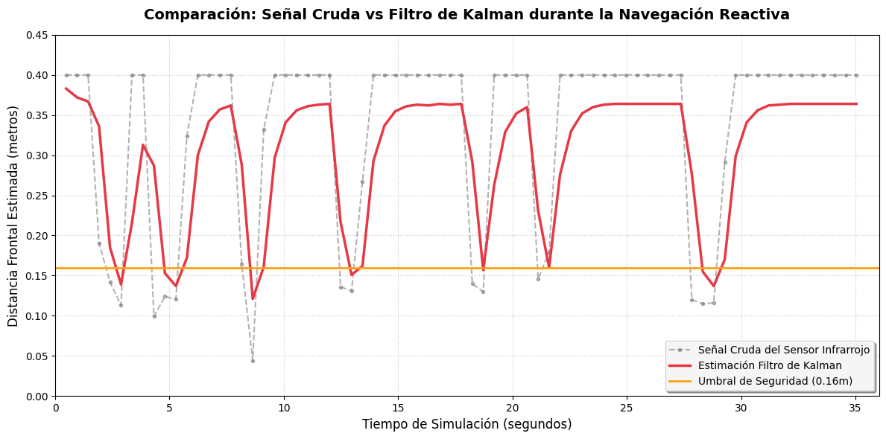

### Integrantes del Grupo:
* Alonso Maurel
* Monserrath Morales
* Pablo Daza
* Miguel Bernales
* Nehemías Leiva

---

## Objetivo del Trabajo
El objetivo de este laboratorio es implementar y evaluar un sistema de percepción y fusión sensorial en un robot móvil autónomo utilizando simulación en Webots. Se busca combinar la información cinemática predictiva de los encoders con la medición del entorno proveniente de sensores de distancia mediante un Filtro de Kalman escalar, garantizando una navegación reactiva robusta y libre de colisiones en entornos de complejidad variable.

## Descripción del Robot y Sensores Utilizados
Se utilizó la plataforma robótica diferencial **e-puck**. Para cumplir con los requerimientos de percepción, se instrumentaron los siguientes dispositivos:
* **Sensores Frontales de Distancia:** Modelos infrarrojos de proximidad `ps0` (frontal derecho) y `ps7` (frontal izquierdo).
* **Sensores Laterales de Distancia:** Modelos `ps2` (lateral derecho a 90°) y `ps5` (lateral izquierdo a 90°).
* **Sensores de Posición (Odometría):** Encoders rotativos integrados en el motor izquierdo (`left wheel sensor`) y motor derecho (`right wheel sensor`).

## Frecuencia de Muestreo Empleada y Datos Registrados
El tiempo de muestreo del controlador ($T_s$) se vinculó directamente al paso básico de simulación del entorno mediante la función robot.getBasicTimeStep(), fijándose en 32 ms, lo que equivale a una frecuencia de muestreo de 31.25 Hz. Esto garantiza la captura síncrona de datos del hardware en cada iteración del reloj físico de Webots.Para el análisis de los resultados, no se pre-programó un límite de tiempo, sino que se realizó una captura observacional. Se dejó correr la simulación en tiempo real y se pausó manualmente la ejecución a los 35.04 s. Las variables de estado acumuladas hasta ese instante se extrajeron copiando directamente los registros de salida (logs) impresos en la consola por el controlador. Dada la frecuencia estricta de 32 ms, esta ventana de tiempo de prueba generó de forma natural un arreglo de exactamente 1.095 muestras, las cuales se utilizaron para generar las métricas y comparativas gráficas.

## Análisis de las Señales Registradas
Los sensores infrarrojos de proximidad del e-puck entregan lecturas crudas adimensionales de cortísimo alcance (valores cercanos a 74 en el vacío y superiores a 3000 al contacto). Para el análisis de distancia, se implementó una función de conversión hiperbólica basada en la atenuación geométrica de la luz:

$$z_k = \frac{15.0}{val_{max}^{0.8}}$$

### Fenómeno Físico de Absorción IR:
Durante los ensayos con obstáculos, se descubrió que las paredes blancas de la arena reflejan eficientemente la señal infrarroja, permitiendo lecturas estables a $0.09\text{ m}$. Sin embargo, al introducir bloques de madera oscura (`WoodenBox`), el material absorbió una fracción significativa de la luz emitida. Esto provocó una lectura parcial del entorno donde el robot estimaba estar más lejos del obstáculo de lo que realmente estaba, requiriendo un ajuste dinámico en los umbrales de seguridad.

## Estimación del Avance mediante Encoders (Odometría)
El desplazamiento lineal del robot se calcula a partir de la variación angular de los encoders entre el ciclo actual $k$ y el ciclo anterior $k-1$. Utilizando el radio de la rueda ($r = 0.0205\text{ m}$), la ecuación cinemática para el avance acumulado del robot ($\Delta d_k$) es:

$$\Delta\theta_{izq} = \theta_{izq, k} - \theta_{izq, k-1}$$
$$\Delta\theta_{der} = \theta_{der, k} - \theta_{der, k-1}$$
$$\Delta d_k = \frac{r \cdot \Delta\theta_{izq} + r \cdot \Delta\theta_{der}}{2}$$

## Filtro Simple Aplicado
Antes de la fusión, se evaluó un Filtro de Media Móvil Exponencial (EMA) para suavizar las perturbaciones rápidas de los sensores de proximidad frontales, definido por la ecuación diferencial discreta:

$$y_k = \alpha \cdot z_k + (1 - \alpha) \cdot y_{k-1}$$

Donde se utilizó un factor de suavizado $\alpha = 0.2$. Si bien el filtro redujo el ruido de alta frecuencia, introdujo un retraso temporal (lag) en fases de aproximación rápida.

## Implementación del Filtro de Kalman
Para lograr una estimación óptima de la distancia frontal libre, se diseñó un Filtro de Kalman lineal escalar que fusiona el avance cinemático (modelo de proceso) con la telemetría infrarroja (modelo de observación).

### Parámetros de Ruido Configuraciones:
* **Covarianza del Proceso ($Q = 0.0001$):** Baja incertidumbre asignada a la lectura de los encoders.
* **Covarianza de la Medición ($R = 0.02$):** Varianza moderada que modela el ruido y la imprecisión del sensor infrarrojo frente a diferentes materiales.

## Descripción de las Etapas de Predicción y Corrección

En cada ciclo de control de 32 ms se ejecutó de forma secuencial el algoritmo de Kalman:

### Etapa 1: Predicción (Propagación del Estado)
Se proyecta la distancia hacia adelante utilizando el desplazamiento calculado por odometría. Al avanzar, la distancia disponible disminuye:
$$\hat{d}_k^- = \hat{d}_{k-1} - \Delta d_k$$
$$P_k^- = P_{k-1} + Q$$

### Etapa 2: Corrección (Actualización con Medición)
Se calcula la Ganancia de Kalman ($K_k$) para ponderar la incertidumbre del modelo frente a la lectura real del sensor ($z_k$), actualizando el estado y la covarianza del error:
$$K_k = \frac{P_k^-}{P_k^- + R}$$
$$\hat{d}_k = \hat{d}_k^- + K_k \cdot (z_k - \hat{d}_k^-)$$
$$P_k = (1 - K_k) \cdot P_k^-$$

## Lógica de Navegación Reactiva Implementada
Se diseñó un sistema algorítmico reactivo gobernado por una **Máquina de Estados Finitos con Histéresis** para mitigar el fenómeno de oscilación crítica ("tiritón") en las esquinas.

* **Umbral de Seguridad:** Fijado en $0.16\text{ m}$ debido a la absorción lumínica de la madera.
* **Toma de Decisiones:** Si $\hat{d}_k > 0.16\text{ m}$, el estado es `RECTO` ($V = 4.0\text{ rad/s}$). Si se cruza el umbral, se evalúan los sensores laterales crudos:
  * Si $ps5 > ps2$ (muro más próximo por la izquierda), se bloquea el estado `DERECHA` ($V_{izq}=2.0, V_{der}=-2.0$).
  * De lo contrario, se bloquea el estado `IZQUIERDA` ($V_{izq}=-2.0, V_{der}=2.0$).
* **Histéresis:** El robot mantiene el giro obligatorio de forma persistente y no vuelve a avanzar recto hasta que la distancia estimada por Kalman sea holgadamente segura ($\hat{d}_k > 0.20\text{ m}$).

## Gráficos de Señales Crudas, Filtradas y Estimadas

### Análisis del Gráfico:
Este gráfico ilustra la diferencia vital entre la percepción directa del robot y su entendimiento procesado al acercarse a un obstáculo. La línea gris punteada representa los datos crudos del sensor infrarrojo, los cuales se muestran sumamente inestables y ruidosos debido a las interferencias de la luz y la textura oscura de la madera; si el controlador tomara decisiones basándose únicamente en esta lectura errática, el sistema ejecutaría giros accidentales o terminaría colisionando. Para solucionar esto, la línea roja continua expone el trabajo del Filtro de Kalman, el cual actúa como el verdadero procesador central del sistema, limpiando el ruido y trazando un descenso suave y confiable de la distancia real. De este modo, cuando el e-puck se aproxima a una pared (representado por las caídas en las gráficas), la estimación filtrada cruza la frontera límite de peligro de 16 centímetros (la línea naranja horizontal) de forma limpia y precisa, ordenando la maniobra de giro en el instante exacto. Una vez que la rotación concluye y la trayectoria vuelve a estar libre, las mediciones saltan repentinamente de regreso a su valor máximo de $0.40\text{ m}$, demostrando que el robot logra esquivar el obstáculo con éxito y continúa su marcha sin experimentar falsas alarmas.

## Resultados Obtenidos en los Escenarios de Prueba

* **Escenario Simple (`escenario_simple.wbt`):** Un entorno cerrado regular. El e-puck se desplazó de forma cíclica rebotando perpendicularmente contra los muros. El filtro de Kalman mantuvo un error de covarianza acotado y la evasión fue 100% exitosa dentro de la ventana de evaluación de $35\text{ s}$.
* **Escenario Complejo (`escenario_complejo.wbt`):** Un laberinto de pasillos estrechos con callejones ciegos y obstáculos de madera de alta absorción. El robot requirió un incremento del umbral de seguridad a $0.16\text{ m}$. El e-puck demostró la capacidad de navegar de forma autónoma, resolviendo las bifurcaciones y giros cerrados mediante evasión reactiva pura sin colisiones registradas.

## Análisis Final y Conclusiones
El laboratorio demostró la viabilidad de la fusión sensorial para corregir las deficiencias físicas de los sensores de bajo costo. El Filtro de Kalman probó ser superior a los filtros basados únicamente en promedios móviles, al incorporar la física del movimiento del robot (encoders) dentro del lazo de estimación. 

En cuanto a la comparativa de comportamiento físico, al contrastar el desempeño del robot en el entorno de simulación, las lecturas crudas provocaron un comportamiento errático, gatillando giros prematuros ante el menor ruido en la señal. Al intentar gobernar la máquina de estados únicamente con el Filtro Simple (Media Móvil Exponencial), el suavizado introdujo un retraso temporal crítico; físicamente, el robot percibía que aún estaba en una zona segura cuando en la realidad ya había cruzado el umbral de los 16 centímetros. Esto se tradujo en una reacción tardía, provocando que el e-puck frenara encima del obstáculo y rozara la caja de madera antes de poder rotar. Por el contrario, la implementación del Filtro de Kalman resolvió ambos extremos: al ser predictivo gracias a la odometría, anuló el retraso temporal y permitió que el robot girara con fluidez y precisión milimétrica sin llegar a tocar las paredes.

Como conclusión crítica del paradigma reactivo, se constata que el sistema carece de consciencia global del entorno (mapeo), por lo que las trayectorias resultantes dependen exclusivamente de la geometría local inmediata y la robustez del filtrado ante cambios en las propiedades de reflectancia de los materiales.

## Instrucciones para Ejecutar la Simulación
1. Clonar este repositorio en su estación de trabajo local.
2. Abrir el software **Webots R2025a**.
3. Ir a `File` -> `Open World` y seleccionar `escenario_simple.wbt` o `escenario_complejo.wbt` (dentro de la carpeta `/worlds`).
